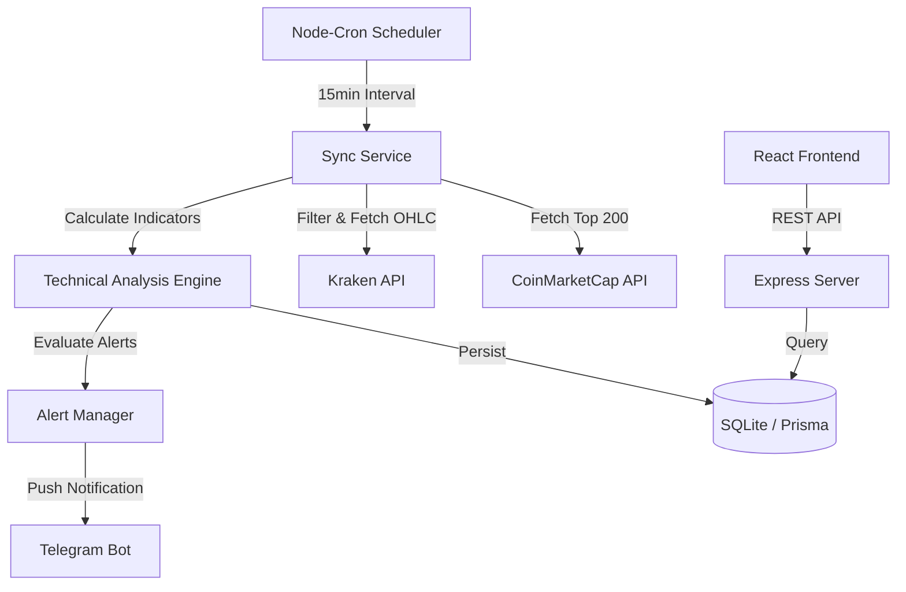

# CryptoTra: Advanced Market Intelligence & Alert System

[](https://react.dev/)
[](https://nodejs.org/)
[](https://www.prisma.io/)
[](https://tailwindcss.com/)
[](https://opensource.org/licenses/ISC)

**CryptoTra** is a comprehensive full-stack application designed for high-frequency market monitoring and automated technical analysis. By cross-referencing high-momentum assets from CoinMarketCap with tradable pairs on Kraken, CryptoTra identifies high-probability opportunities and delivers real-time alerts directly to your Telegram.

---

## 🏗️ System Architecture

CryptoTra utilizes a robust background synchronization engine and a decoupled frontend-backend architecture to provide low-latency market insights.



---

## ✨ Key Features

- **🚀 Smart Asset Discovery**: Automatically filters top gainers and losers from CoinMarketCap and cross-references them with available Kraken trading pairs.
- **📊 Automated Technical Analysis**: Real-time calculation of critical indicators:
  - **EMA**: 21, 50, and 200 periods for trend identification.
  - **RSI**: 14-period Relative Strength Index for overbought/oversold signals.
  - **Volume Analysis**: 100-period average volume comparison to detect breakouts.
- **🔔 Real-Time Telegram Alerts**: Instant notifications for specific market triggers (e.g., volume spikes, EMA crossovers, or rapid price movement).
- **🔄 Robust Sync Engine**: Integrated `node-cron` automation ensures the database is updated every 15 minutes without manual intervention.
- **📱 Modern Dashboard**: A responsive React-based interface featuring:
  - High-level gainer/loser overviews.
  - Detailed candle-by-candle performance analysis.
  - Toast notifications for real-time status updates.

---

## 🛠️ Technology Stack

### Backend
- **Runtime**: Node.js
- **Framework**: Express.js
- **Database**: SQLite (via Prisma ORM)
- **Scheduling**: Node-cron
- **API Clients**: Axios

### Frontend
- **Framework**: React 19 (Vite)
- **Styling**: Tailwind CSS 4
- **Notifications**: React Toastify
- **State Management**: React Hooks (useState/useEffect)

### External Integrations
- **Market Data**: Kraken Public API, CoinMarketCap API
- **Messaging**: Telegram Bot API

---

## 🚀 Getting Started

### Prerequisites
- Node.js (v20 or higher)
- npm or yarn
- A CoinMarketCap API Key
- A Telegram Bot Token (from [@BotFather](https://t.me/botfather))

### Installation

1. **Clone the repository**:
   ```bash
   git clone https://github.com/SwinSwinning/CryptoTra.git
   cd CryptoTra
   ```

2. **Setup the Backend**:
   ```bash
   cd server
   npm install
   ```

3. **Configure Environment Variables**:
   Create a `.env` file in the `server` directory:
   ```env
   # API Keys
   PROD_API_KEY=your_coinmarketcap_api_key
   
   # Telegram Configuration
   TELEGRAM_BOT_TOKEN=your_bot_token
   TELEGRAM_CHAT_ID=your_chat_id
   
   # Server Configuration
   PORT=8080
   NODE_ENV=prod
   ```

4. **Initialize Database**:
   ```bash
   npx prisma migrate dev --name init
   ```

5. **Setup the Frontend**:
   ```bash
   cd ../client
   npm install
   ```

---

## 📖 Usage

### Running the Application

1. **Start the Backend Server**:
   ```bash
   cd server
   npm run dev
   ```
   The API will be available at `http://localhost:8080`.

2. **Start the Frontend Dashboard**:
   ```bash
   cd client
   npm run dev
   ```
   The dashboard will be available at `http://localhost:5173`.

### Key API Endpoints

| Endpoint | Method | Description |
| :--- | :--- | :--- |
| `/upd` | `GET` | Manually triggers the Gainer/Loser sync process. |
| `/ret` | `GET` | Returns all records currently in the database. |
| `/getrecords` | `GET` | Retrieves records with optional `?ticker=` filtering. |
| `/tic` | `GET` | Updates the list of available cross-exchange pairs. |
| `/del` | `GET` | Clears all candle data from the database. |

---

## 🛡️ Technical Analysis Logic

CryptoTra evaluates market conditions based on multi-factor triggers:

```javascript
// Example of an Uptrend Trigger
const upcond = 
    candle.last6change > 3 &&            // >3% change in last 6 candles
    minAvgVol &&                         // Volume > 1000 units
    candle.price > candle.ema200 &&      // Price above EMA 200
    candle.ema50 > candle.ema200 &&      // Bullish EMA crossover
    candle.rsi14 < 70;                   // Not yet overbought
```

---

## 🤝 Contributing

1. Fork the Project
2. Create your Feature Branch (`git checkout -b feature/AmazingFeature`)
3. Commit your Changes (`git commit -m 'Add some AmazingFeature'`)
4. Push to the Branch (`git push origin feature/AmazingFeature`)
5. Open a Pull Request

---

## 📄 License

Distributed under the **ISC License**. See `LICENSE` for more information.

---

Developed with ❤️ by [SwinSwinning](https://github.com/SwinSwinning)
